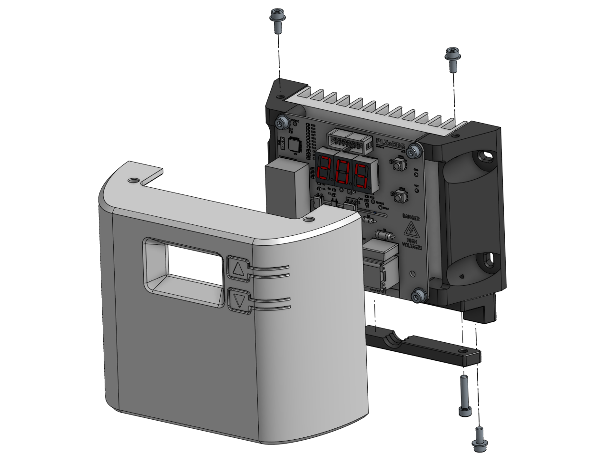

# PLZoREG - PV Power Regulator


PLZoREG is a power regulator designed to sit between a photovoltaic (PV) inverter and a domestic hot water (DHW) heater. It solves the problem of cheap grid-tie inverters oscillating under varying loads during cloudy conditions, which causes audible noise from the heating elements.



Designed in [Onshape](https://cad.onshape.com/documents/f103c5e3fbe2c6c85b2f1c34/w/b57b1089b11cbe9058b16474/e/0dcdb83c0b13157c67edb204?explodedView=Mp3pZAKuXcCp%2B0x2f&renderMode=0&rightPanel=explodedViewPanel&uiState=69bc7ba3b56ad930e86b1156).

## Problem Statement

Low-cost PV inverters often struggle to maintain stable output when the load (DHW heater) exceeds the available solar power on cloudy days. The inverter attempts to deliver maximum power but fails to maintain output voltage, causing the load to cycle on and off rapidly. This creates:
- Audible buzzing/humming from heating spirals
- Inefficient operation and potential inverter shutdown
- Reduced energy harvesting

## Solution

PLZoREG monitors the inverter's output voltage and dynamically adjusts power delivery to the heater using phase-angle PWM control. By maintaining the inverter's output voltage above a configurable threshold, it prevents voltage collapse and keeps the inverter operating in its stable region.

### Key Features

- **Voltage monitoring**: Real-time measurement of inverter output voltage
- **Adaptive PWM regulation**: Automatic duty cycle adjustment (0-100%)
- **User-configurable target voltage**: Set target between 100-240V
- **Temperature monitoring**: Heater and MCU temperature sensing
- **Safety features**: Overtemperature protection, zero-cross synchronization detection
- **Persistent settings**: Target voltage stored in flash memory
- **Simple 2-button interface**: 3-digit 7-segment display with up/down controls

## Hardware

The hardware design is located in `board/` (KiCad 8 project).

**Microcontroller**: PY32F030x8 (ARM Cortex-M0+)

**Key Components**:
- Zero-cross detection for AC synchronization
- Phase-angle PWM control for power regulation
- Voltage sensing circuitry
- Temperature sensors (NTC for heater, internal for MCU)
- 3-digit 7-segment LED display
- 2-button user interface

## Firmware

The firmware is written in TinyGo and located in `fw/`.

### Prerequisites

- [TinyGo](https://tinygo.org/) (latest version recommended)
- [pyOCD](https://pyocd.io/) for flashing
- ARM GCC toolchain (for debugging)
- Make

### Building and Flashing

```bash
cd fw
make build    # Compile firmware
make flash    # Build and flash to device
```

### Debugging

```bash
make gdb      # Start GDB server with semihosting
make rtt      # Connect to RTT output for debug messages
```

### Architecture

**Key Packages**:
- `main.go`: Main control loop, state machine, regulation algorithm
- `display/`: 7-segment LED display driver (hardware-abstracted with build tags)
- `keyboard/`: Button input handler with key repeat and press detection
- `flash/`: Flash memory operations for persistent settings
- `adc/`, `pwm/`, `zcd/`: Hardware peripheral drivers

**Control Algorithm**:
The regulation loop (500ms cycle) compares sensed voltage with target voltage:
- If `VSense < VTarget`: Decrease duty cycle (reduce load)
- If `VSense > VTarget`: Increase duty cycle (increase load)
- Duty cycle changes by ±1% per cycle for smooth regulation

**Build Tags**: The project uses Go build tags for hardware abstraction:
- `py32`: PY32 family-specific code
- `py32f030`: PY32F030 variant-specific pin mappings

### User Interface

The firmware provides a page-based UI with 5 information pages:
1. **Voltage Sense** (no decimal): Current inverter voltage (e.g., `220`)
2. **Voltage Target** (trailing decimal): Target voltage setpoint - adjustable (e.g., `220.`)
3. **Duty Cycle** (decimal format): Current PWM duty cycle (e.g., `0.75` = 75%)
4. **Triac Temperature** (° symbol): Triac heatsink temperature (e.g., `50°`)
5. **MCU Temperature** (.° symbols): Microcontroller temperature (e.g., `50.°`)

Navigation:
- **Up/Down buttons**: Cycle through pages
- **Hold both buttons (1s)**: Enter/exit setting mode on adjustable pages (V. and .d)
- **In setting mode**: Up/Down buttons adjust the value

Error Codes:
- **E01**: No zero-cross synchronization detected
- **E02**: Overtemperature (triac > 90°C)

## Development

See [CLAUDE.md](CLAUDE.md) for detailed development guidance and architecture notes for AI assistants.

### Code Style

- Minimal abstractions: code is direct and hardware-focused
- No dynamic memory allocation (GC disabled)
- Task-based scheduler
- Prefer clarity over brevity

### Making Changes

1. Ensure all builds run from `fw/` directory
2. Test display changes across build tag variants
3. Verify settings persistence after power cycle
4. Check regulation stability under varying voltage conditions

## License

[Add license information]

## Contributing

[Add contribution guidelines if applicable]
