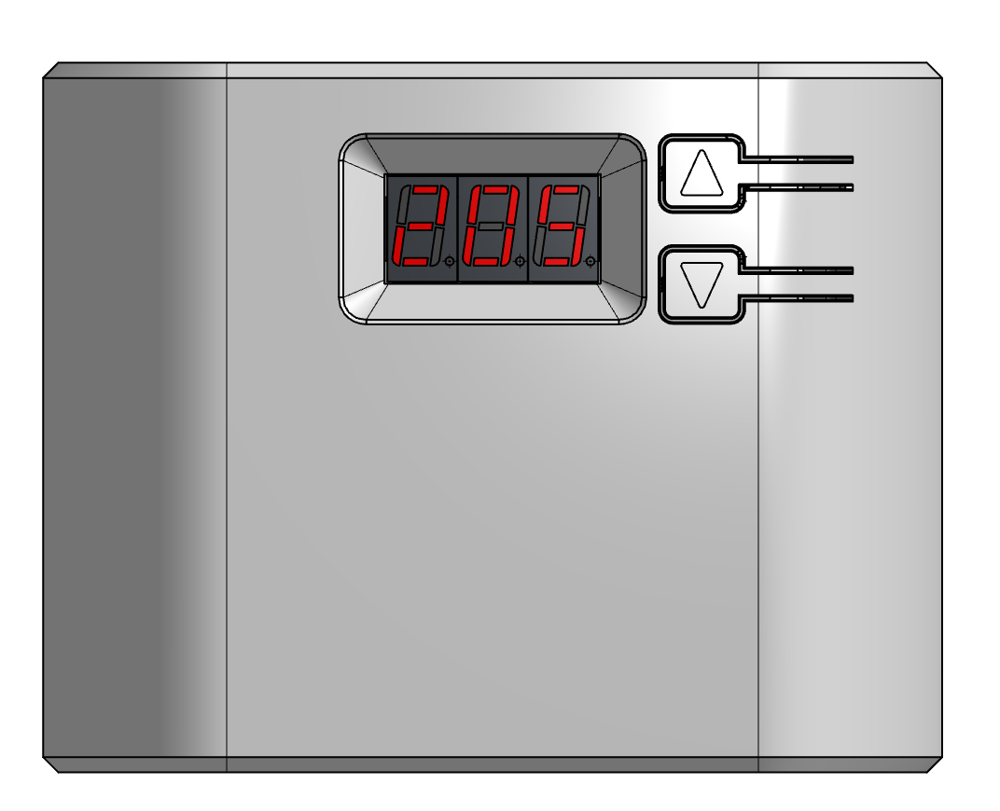
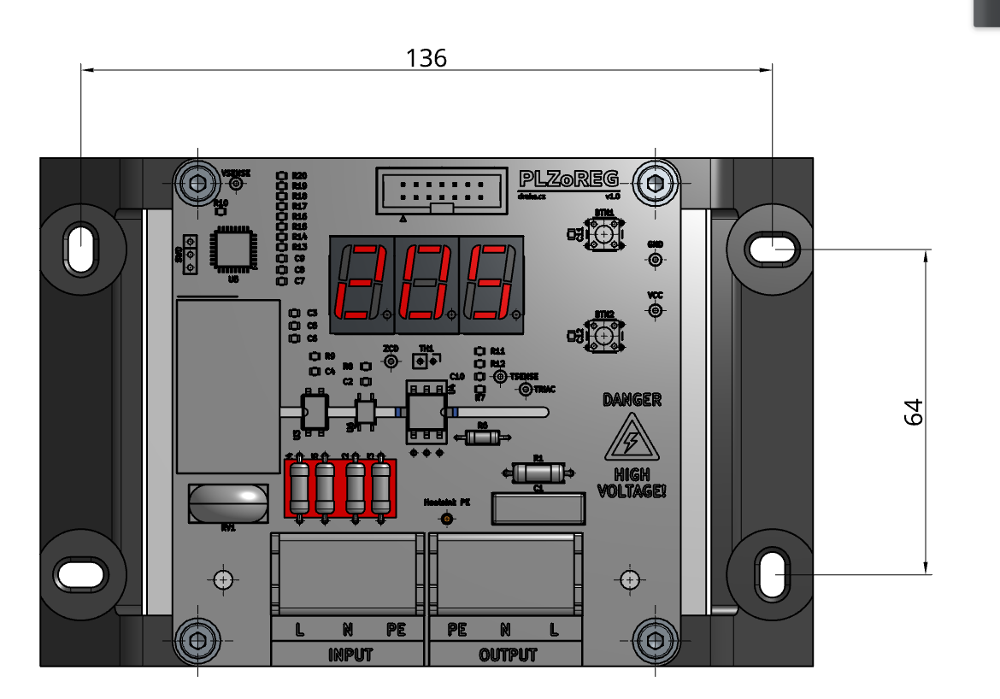

# PLZoREG User Manual

## Introduction

PLZoREG is an automatic power regulator that sits between your photovoltaic (PV) inverter and electric water heater. It prevents your inverter from shutting down or making noise during cloudy weather by smoothly controlling the power delivered to your heater.

## Installation

**WARNING**: Installation involves high voltage AC wiring. Installation must be performed by a qualified electrician in accordance with local electrical codes.

1. Mount the device in a suitable location between the inverter and heater
2. Connect the input to your PV inverter's AC output
3. Connect the output to your water heater
4. Ensure proper grounding and circuit protection
5. Power on the system

## Display and Controls

The device has a **3-digit display** and **two buttons**:
- **UP button** (↑)
- **DOWN button** (↓)

The display shows different information depending on which page is selected.

## Operating Pages

Press the UP or DOWN button to cycle through the information pages:

### 1. Voltage Sense
**Display**: Voltage without decimal point (e.g., `220`)

Shows the current voltage from your PV inverter. This value changes as cloud cover varies.

- **Normal operation**: 180-240V (depends on your system)
- **Action**: None required - informational only

### 2. Voltage Target
**Display**: Voltage followed by decimal point (e.g., `220.`)

This is the **target voltage** you want to maintain. The device will reduce power to the heater if the inverter voltage drops below this value.

**To adjust**:
1. Hold BOTH buttons for 1 second - the decimal point will blink
2. Press UP to increase, DOWN to decrease (range: 100-240V)
3. Hold BOTH buttons for 1 second to save and exit

**Recommended setting**: 200-210V for most systems
- **Higher values** (220-230V): More conservative, less noise, but less power usage
- **Lower values** (180-200V): More aggressive, uses more solar power, but may cause occasional inverter instability

### 3. Duty Cycle
**Display**: Duty cycle as decimal number (e.g., `0.75` = 75%)

Shows the current power level being delivered to the heater:
- **0.00**: No power (heater off)
- **1.00**: Full power (heater at maximum)

The device automatically adjusts this value to maintain your target voltage.

**Manual override** (advanced):
1. Hold BOTH buttons for 1 second to enter manual mode
2. Press UP/DOWN to adjust in 5% increments
3. Hold BOTH buttons to exit manual mode (automatic regulation resumes)

### 4. Triac Heatsink Temperature
**Display**: `°` Temperature followed by ° symbol (e.g., `50°`)

Shows the temperature of the switching element (informational value):
- **Normal**: 20-80°C during operation
- **Warning**: Above 90°C triggers safety shutdown

### 5. MCU Temperature
**Display**: `.°` Temperature followed by decimal point and ° symbol (e.g., `50.°`)

Shows the device's internal temperature (informational value):
- **Normal**: 20-60°C
- **Informational only** - no action required

## Error Codes

If an error occurs, the display shows `E` followed by a number:

### E01 - No Synchronization
**Meaning**: Device cannot detect AC power synchronization signal

**Possible causes**:
- No input power
- Wiring issue
- Hardware fault

**Action**: Check that the inverter is powered and outputting AC. If problem persists, contact support.

### E02 - Overtemperature
**Meaning**: Triac temperature exceeded 90°C

**Possible causes**:
- Insufficient cooling/ventilation
- Excessive load current
- Hardware fault

**Action**:
1. Immediately disconnect power
2. Check device ventilation and cooling
3. Verify load current is within specifications
4. Allow system to cool before restarting

**Safety note**: When any error is active, power output is automatically shut off.

## Normal Operation

1. **Sunny conditions**:
   - Display shows V.sense near or above V.target
   - Duty cycle approaches 100%
   - Maximum power delivered to heater

2. **Partly cloudy**:
   - Display shows V.sense fluctuating
   - Duty cycle adjusts automatically (20-90%)
   - Device regulates power smoothly

3. **Very cloudy/low light**:
   - Display shows V.sense at or below V.target
   - Duty cycle near 0%
   - Minimal power to heater

## Tips for Optimal Operation

- **Set target voltage conservatively** on first use - start at 210V and adjust down if system is stable
- **Monitor for a few days** under various weather conditions before making final adjustments
- **Check temperature page** occasionally to ensure heater is operating normally
- **Don't set target too low** - this defeats the purpose and may cause the noise you're trying to avoid

## Maintenance

- No regular maintenance required
- Keep ventilation openings clear
- Periodically check that display is functioning
- Verify temperature readings are reasonable

## Specifications

- **Input voltage**: 100-240V AC (from PV inverter)
- **Output control**: 0-100% phase-angle PWM
- **Target voltage range**: 100-240V (user configurable)
- **Temperature monitoring**: Up to 90°C (safety limit)
- **Response time**: 500ms update cycle
- **Settings retention**: Non-volatile (survives power loss)

## Troubleshooting

| Symptom | Possible Cause | Solution |
|---------|---------------|----------|
| Display blank | No power | Check input power |
| Constant E01 error | No AC input | Verify inverter is active |
| E02 error frequently | Overheating | Check ventilation and cooling |
| Inverter still noisy | Target voltage too low | Increase target voltage setting |
| Low power usage | Target voltage too high | Decrease target voltage setting |
| Display showing wrong values | Needs recalibration | Contact support |

## Technical Support

[Add contact information]

## Safety Warnings

- ⚠️ **HIGH VOLTAGE** - Do not open the device enclosure
- ⚠️ **Installation by qualified personnel only**
- ⚠️ **Do not bypass error conditions**
- ⚠️ **Ensure proper grounding**
